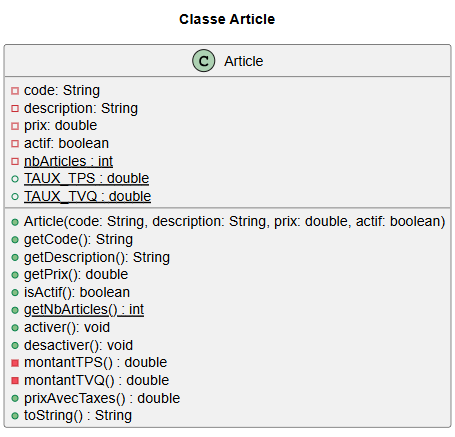

# Les membres statiques en Java

## 1. Définition et vocabulaire

### 1.1. Qu'est-ce que `static`?

En Java, le mot-clé **`static`** associe un membre (attribut ou méthode) **à la classe elle‑même**, plutôt qu'aux **instances** (objets) de cette classe. Autrement dit, un membre `static` est **partagé par toutes les instances** et **accessible via le nom de la classe**.

### 1.2. Attribut d'instance *vs* Attribut de classe

|Type d'attribut|Description|
|---|---|
|Attribut *d'instance*|Chaque objet possède **sa propre copie** de l'attribut.|
|Attribut *de classe* (statique)|**Une seule copie** partagée pour **toutes les instances** de la classe.|

### 1.3. Méthode d'instance *vs* Méthode de classe

|Type de méthode|Description|
|---|---|
|Méthode *d'instance*|Nécessite un objet concret qui a été instancié avec `new` pour être appelée (elle peut utiliser `this`).|
|Méthode *de classe* (statique)|Rattachée à la classe, **ne dépend pas d'un objet** (pas de `new` ni de `this`). Elle se concentre sur des opérations **générales** ou sur des **données statiques**.|

---

## 2. Attributs statiques (attributs de classe)

### 2.1. Déclaration d'un attribut statique

```java
public class Facture {
    private static int compteur;                // attribut de classe
    public static final double TAUX_TPS = 0.05; // attribut de classe constant
}
```

### 2.2. Initialisation d'un attribut statique

- **À la déclaration** :

    ```java
    public class Config {
        public static String appName = "MonAppli";
        private static int version = 1;
    }
    ```

- **Dans un bloc `static`** (utile si l'initialisation est plus complexe) :

    ```java
    public class Config {
        public static String appName;
        private static int version;
        static {
            appName = "MonAppli";
            version = 1;
        }
    }
    ```

### 2.3. Accès aux attributs statiques

- Via le **nom de la classe** :

    `NomDeClasse.attributStatique` ou `NomDeClasse.getAttributStatique()`, selon la visibilité de l'attribut.

    ```java
    double tauxTps = Facture.TAUX_TPS;  // recommandé
    ```

- Via une instance de la classe :

    `nomObjet.attributStatique` ou `nomObjet.getAttributStatique()`, selon la visibilité de l'attribut.

    ```java
    Facture f = new Facture();
    double tauxTps = f.TAUX_TPS;        // possible mais DÉCONSEILLÉ (peu clair, objet inutile)
    ```

### 2.4. Exemple simple : classe Étudiant avec compteur auto-incrémentiel

```java
public class Etudiant {
    public static final String NOM_DEFAUT = "Jean Jean";
    private static int nbEtudiants = 0; // partagé entre tous les étudiants
    private String nom;                 // propre à chaque étudiant

    public Etudiant(String nom) {
        setNom(nom);
        nbEtudiants++;
    }

    public Etudiant() {
        this(NOM_DEFAUT);
    }

    public void setNom(String _nom) {
        // logique de contrôle du nom ici
    }

    public static int getNbEtudiants() { // méthode statique!
        return nbEtudiants;
    }
}

// Utilisation
Etudiant a = new Etudiant("Léa");
Etudiant b = new Etudiant("Anna");
Etudiant c = new Etudiant(); // son nom est 'Jean Jean'
System.out.println(Etudiant.getNbEtudiants()); // 3
```

### 2.5. Cas d'usage typiques

- **Constantes** partagées (`static final`)
- **Compteurs** (nombre d'objets créés, identifiants auto‑incrémentés)
- **Partage de ressources** (connexion à une BD, configurations)

## 3. Méthodes statiques (méthodes de classe)

### 3.1. Déclaration d'une méthode statique

```java
public class Operations {
    public static int carre(int n) {
        return n * n;
    }

    public static double oppose(double n) {
        return -n;
    }
}
```

### 3.2. Appel d'une méthode statique

- Via le **nom de la classe** : `NomDeClasse.methodeStatique()`. **C'est la façon de faire**.

    ```java
    int r = Operations.carre(5); // 25
    double x = Operations.oppose(3.14); // -3.14
    ```

- Via une instance de la classe : `nomObjet.methodeStatique()`. Possible, mais **déconseillé**, car encore une fois l'objet n'est pas nécessaire.

    ```java
    Operations op = new Operations();
    int c = op.carre(8); // l'instance op est superflue
    ```

### 3.3. Exemple simple : Conversions de températures

```java
public class Temperature {
    // Conversion Celsius -> Fahrenheit
    public static double celsiusVersFahrenheit(double c) {
        return c * 9.0/5.0 + 32.0;
    }

    // Conversion Fahrenheit -> Celsius
    public static double fahrenheitVersCelsius(double f) {
        return (f - 32.0) * 5.0/9.0;
    }
}

// Utilisation
System.out.println(Temperature.celsiusVersFahrenheit(20)); // 68.0
```

### 3.4. Cas d'usage typiques

- **Fonctions utilitaires** (opérations de maths, conversions, validation, saisie, etc.)
- **Points d'entrée** comme `public static void main(String[] args)`

## 4. Règles et contraintes importantes

### 4.1. Une méthode statique ne peut pas accéder aux attributs d'instance

Comme leur nom l'indique, les attributs d'instance appartiennent à une instance. Dans un contexte statique (la classe), il est logique que ces attributs soient inaccessible.

Si vous tentez de mainpuler un attribut d'instance dans une méthode déclarée `static`, le compilateur va générer une erreur de syntaxe `Cannot make a static reference to the non-static field ...`.

```java
public class Exemple {
    private int a = 10;                 // attribut d'instance
    private static int b = 20;          // attribut de classe

    public static void demo() {
        // System.out.println(a);   // ❌ Interdit : pas d'accès direct à un attribut d'instance
        System.out.println(b);      // ✅ OK : accès à un attribut statique
    }
}
```

### 4.2. Une méthode statique ne peut pas appeler directement une méthode d'instance

Comme une méthode d'instance a accès aux attributs d'instance, on se retrouverait à contrevenir à la règle 4.1 si c'était le cas.

Le compilateur vous attend avec l'erreur `Cannot make a static reference to the non-static method ... from the type ...`.

```java
public class Exemple {
    public void methodeInstance() {
        /* accès possible aux attributs d'instance */
    }

    public static void methodeStatique() {
        // methodeInstance();           // ❌ Interdit sans une instance
        Exemple obj = new Exemple();
        obj.methodeInstance();          // ✅ OK via une instance créée (mais inutile en pratique)
    }
}
```

### 4.3. Absence de `this` dans un contexte statique

Par définition, `this` est une variable référence vers l'objet courant, donc une instance. Il n'a ainsi aucun sens dans le contexte statique.

Cette fois c'est l'erreur `Cannot use this in a static context` qui vous guette!

```java
public class Demo {
    private static int x;

    public static void m() {
        // System.out.println(this.x); // ❌ Interdit : pas de this en statique
    }
}
```

### 4.4. Attributs statiques partagés entre toutes les instances

Tous les objets *voient* et modifient **la même valeur** d'un attribut statique.

## 5. Exemples d'applications complètes

### 5.1. Exemple : compteur d'objets créés

```java
public class Session {
    private static int count = 0; // partagé
    private final int id;         // propre à l'instance

    public Session() {
        count++;
        this.id = count;
    }

    public int getId() { return id; }
    public static int getCount() { return count; }
}

// Utilisation
Session s1 = new Session();
Session s2 = new Session();
System.out.println(s1.getId());      // 1
System.out.println(s2.getId());      // 2
System.out.println(Session.getCount()); // 2
```

### 5.2. Exemple : attribut partagé constant (`static final`)

```java
public class Physique {
    public static final double G = 9.80665;     // constante gravitationnelle
    public static final double PI = 3.14159;
    public static final double H = 6.62607e-34; // constante de Planck
}

// Utilisation
System.out.println(Physique.G);     // 9.80665
System.out.println(Physique.PI);    // 3.14159
System.out.println(Physique.H);     // 6.62607E-34
```

> **RAPPEL** : `static final` indique une **constante de classe** : valeur *partagée* et *non modifiable*.

### 5.3. Exemple : méthode utilitaire de conversion

```java
public class Conversions {
    public static final double MILE_DANS_1_KM = 0.621371;

    public static double kmVersMiles(double km) {
        return km * MILE_DANS_1_KM; // facteur simple
    }
}

// Utilisation
System.out.println(Conversions.kmVersMiles(12)); // 7.4564520000000005
```

## 6. Résumé / Fiche-mémoire

### 6.1. À retenir

- `static` rattache le membre **à la classe** (une seule copie partagée).
- **Accès recommandé** : `NomDeClasse.membre` ou `NomDeClasse.getMembre()`.
- Les **méthodes statiques** ne peuvent pas utiliser `this` ni accéder directement aux **membres d'instance**.
- Utiliser `static` pour : **constantes partagées**, **fonctions utilitaires**, **compteurs d'instance**.

### 6.2. Erreurs courantes

- Appeler une méthode statique ou accéder à un attribut statique via une **instance** (possible mais confus).
- Tenter d'accéder à un **attribut d'instance** depuis une **méthode statique**.
- Oublier `final` pour les **constantes** (risque de modification involontaire).

## EXERCICE

À partir du diagramme UML et des contraintes suivantes, faire l'implémentation complète de la classe `Article` :

### Diagramme UML



### Contraintes

- `TAUX_TPS = 0.05`
- `TAUX_TVQ = 0.09975`
- Le `code` ne peut pas être `null` ou vide (transparent) et la `description` ne peut pas être `null`
