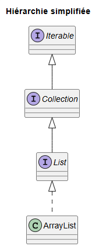

# La classe `java.util.ArrayList`

## 1. Introduction

### 1.1 Pourquoi utiliser des collections plutôt que des tableaux?

Les tableaux en Java ont une taille fixe et ne permettent pas l'ajout ou la suppression dynamique d'éléments. Les collections, dont `ArrayList`, permettent de gérer facilement des données dont la taille varie en cours d'exécution.

### 1.2 Présentation de l'interface `List` et du rôle de la classe `ArrayList`

`ArrayList` implémente l'interface `List`, ce qui lui donne accès à un ensemble riche de méthodes standardisées. C'est une structure de données très utilisée pour stocker des listes dynamiques, c'est-à-dire dont les éléments peuvent varier en cours d'exécution.



|Élément|Description|Niveau d’abstraction|Accès index|Méthodes notables|
|---|---|---|---|---|
|[`Iterable`](https://docs.oracle.com/javase/8/docs/api/java/lang/Iterable.html)|Permet de parcourir les éléments|Très élevé|❌|`forEach` : appliquer une fonction de rappel sur tous les éléments|
|[`Collection`](https://docs.oracle.com/javase/8/docs/api/java/util/Collection.html)|Permet aussi les ajouts et les suppressions|Élevé|❌|`add(E e)` : ajouter un élément `e` à la collection|
|||||`addAll(Collection<? extends E> c)` : ajouter une collection `c` à la collection|
|||||`clear()` : supprime tous les éléments de la collection|
|||||`contains(Object o)` : retourne `true` si l'élément `o` est présent dans la collection|
|||||`remove(Object o)` : supprime une instance de l'élément fourni, s'il est dans la collection|
|||||`removeAll(Collection<?> c)` : supprime de la collection tous les éléments se trouvant dans `c`|
|||||`size()` : retourne le nombre d'éléments dans la collection|
|||||`isEmpty()` : retourne `true` si la collection est vide|
|[`List`](https://docs.oracle.com/javase/8/docs/api/java/util/List.html)|Ajoute les notions d'indice et d'ordre (tri)|Moyen|✅|`add(int index, E element)` : ajouter un élément `element` à la position `index` de la liste|
|||||`get(int index)` : retourne l'élément à l'indice `index` de la liste|
|||||`indexOf(Object o)` : retourne l'indice de la première occurence de l'élément `o` s'il est présent dans la liste, `-1` sinon|
|||||`lastIndexOf(Object o)` : retourne l'indice de la dernière occurence de l'élément `o` s'il est présent dans la liste, `-1` sinon|
|||||`remove(int index)` : supprime l'élément à l'indice `index` de la liste|
|||||`set(int index, E element)` : remplace l'élément à l'indice `index` par `element` dans la liste|
|||||`sort(Comparator<? super E> c)` : trie la liste selon l'ordre déterminé par le comaparateur `c`|
|[`ArrayList`](https://docs.oracle.com/javase/8/docs/api/java/util/ArrayList.html)|Ajoute la gestion de la capacité|Faible|✅|`ensureCapacity(int minCapacity)` : augmente la capacité de cette `ArrayList` à la capacité fournie, si nécessaire|
|||||`trimToSize()` : réduit la capacité de l'`ArrayList` à sa taille|

### 1.3 Quand utiliser une `ArrayList`?

Lorsque vous devez stocker une liste d'éléments pouvant changer de taille, et lorsque l'accès rapide par index est important.

## 2. Importation et création d'une `ArrayList`

La classe `ArrayList` fait partie du *package* `java.util`.

### 2.1 Importation

```java
import java.util.ArrayList;
```

### 2.2 Instanciation

- **À gauche**  
  On déclare la variable référence à l'aide d'un type de notre choix.

```java
List<String> noms = new ArrayList<>();          // noms aura accès aux membres de `List` (pas de méthodes pour la capacité), plus flexible
ArrayList<Integer> notes = new ArrayList<>();   // notes aura accès aux membres de `ArrayList`
```

### 2.3 Comparaison rapide avec un tableau

- **Tableau** : taille fixe, syntaxe simple.
- **`ArrayList`** : taille dynamique, nombreuses méthodes utilitaires.

## 3. Les opérations fondamentales

### 3.1 Ajouter des éléments

```java
noms.add("Maxime");
```

### 3.2 Accéder

```java
String n = noms.get(0);
```

### 3.3 Modifier

```java
noms.set(0, "Alex");
```

### 3.4 Supprimer

```java
noms.remove(0);
```

### 3.5 Taille

```java
noms.size();
```

### 3.6 Vérifier la présence

```java
noms.contains("Maxime");
```

### 3.7 Vider

```java
noms.clear();
```

## 4. Parcourir une ArrayList

### 4.1 Boucle for indexée

```java
for (int i = 0; i < noms.size(); i++) {
    System.out.println(noms.get(i));
}
```

### 4.2 Boucle for-each

```java
for (String nom : noms) {
    System.out.println(nom);
}
```

### 4.3 Iterator

```java
Iterator<String> it = noms.iterator();
while (it.hasNext()) {
    System.out.println(it.next());
}
```

## 5. Les génériques

En Java, les **génériques** permettent de :
> paramétrer un type avec un autre type.

Autrement dit :
> *« Je veux une liste, mais une liste de quoi exactement ? »*

### 5.1 Pourquoi ?

Ils permettent d'assurer la sécurité des types.

### 5.2 Déclaration

```java
List<String> noms = new ArrayList<>();
ArrayList<Integer> nombres = new ArrayList<>();
ArrayList<Etudiant> etudiants = new ArrayList<>();
```

### 5.3 Erreurs communes

- Oublier les `< >` : utilisation brute.
- Confondre types primitifs et objets (`int` vs `Integer`).

## 6. Composition

### 6.1 Stocker des objets

```java
class Groupe {
    private ArrayList<Etudiant> liste = new ArrayList<>();
}
```

### 6.2 Exemple UML

`Groupe` **compose** plusieurs `Etudiant`.

## 7. Erreurs fréquentes

- `length` vs `size()`
- `IndexOutOfBoundsException`
- Types incorrects
- `ConcurrentModificationException`

## 8. Bonnes pratiques

- Toujours typer les collection
- Déclarer sous l'interface `List`, à moins d'avoir besoin des méthodes `ensureCapacity()` ou `trimToSize()`.

```java
List<String> noms = new ArrayList<>();
```

## 9. Résumé

- La classe `ArrayList` permet de manipuler des listes **dynamiques**
- Elle possède de **nombreuses méthodes utiles**
- Sécurisée par les **génériques** (type des données
- Idéale pour la composition / l'agrégation
