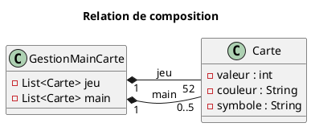

# Composition et agrégation en UML

En UML, **la composition** et **l'agrégation** sont deux formes particulières d'**association**.  
Elles servent à modéliser une relation de type **« a-un »** entre deux classes, mais avec un
degré de dépendance différent entre le *tout* et la *partie*.

## 1. Agrégation

### Définition : agrégation

L'**agrégation** représente une relation *a-un* **faible** :

- la partie peut **exister indépendamment** du tout;
- la destruction du tout **n'entraîne pas** celle des parties.

### Représentation UML : ◇

- **Losange vide (◇)** du côté de la classe *conteneur* (le « tout »).
- Tout ◇──── Partie

### Exemple conceptuel

Une `Bibliotheque` agrège des `Livre` :

- les livres existent même si la bibliothèque disparaît.

## 2. Composition

### Définition : composition

La **composition** est une relation *a-un* **forte** :

- la partie **n'existe pas sans le tout** ;
- le cycle de vie de la partie dépend entièrement de celui du tout.

### Représentation UML : ◆

- **Losange plein (◆)** du côté de la classe *conteneur* (le « tout »).
- Tout ◆──── Partie

## 3. Exemple : Gestion d'un jeu de cartes

### Contexte

On considère une classe `GestionMainCarte` qui gère :

- un **jeu** de 52 cartes
- une **main** de 0 à 5 cartes

En Java, ces cartes peuvent être stockées dans des `ArrayList<Carte>`, mais **UML ne modélise pas les détails d'implémentation** (comme `ArrayList`).

Ce qui nous intéresse en UML est la relation **conceptuelle** :

> `GestionMainCarte` **possède** des `Carte`.

## 4. Type de relation entre `GestionMainCarte` et `Carte`

La relation appropriée est une **composition** :

- les cartes sont créées, gérées et distribuées par `GestionMainCarte`
- elles n'ont pas de sens, dans ce modèle, sans ce gestionnaire.

➡️ `GestionMainCarte` est le **tout**  
➡️ `Carte` est la **partie**

## 5. Représentation UML (description)

- **Losange plein** du côté de `GestionMainCarte`
- Deux relations distinctes vers `Carte`
- Des **rôles** pour distinguer les collections :
  - `jeu`
  - `main`
- Des **multiplicités** pour exprimer les contraintes
  - Un objet `GestionMainCarte` possède `1` attribut `jeu` qui contient exactement `52` cartes
  - Un objet `GestionMainCarte` possède `1` attribut `main` qui contient entre `0` et `5` cartes

## 6. Point important : collections et UML

- `ArrayList`, `List`, `LinkedList`, etc. sont des **détails d'implémentation**
- En UML, on ne fait **pas de composition avec `ArrayList`**
- La relation se fait toujours entre les **classes métier**

On peut éventuellement indiquer :

`jeu : List<Carte>`  
`main : List<Carte>`

mais sans introduire `List` ou `ArrayList` comme classes du diagramme.

## 7. Résumé

| Notion | Agrégation | Composition |
| --- | --- | --- |
| Force du lien "*a un*" | Faible | Forte |
| Symbole UML | ◇ | ◆ |
| Cycle de vie des parties | Indépendant | Dépend du tout |
| Exemple cartes | ❌ | ✅ |

> **Règle d'or UML :** on modélise le *concept*, pas la structure de données du langage.
