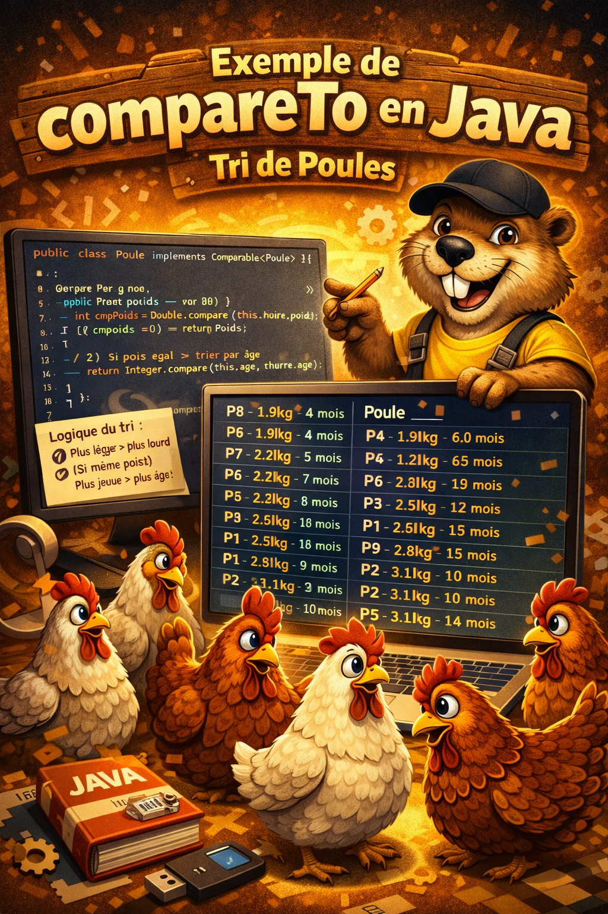

# Exemple de compareTo en Java --- Tri de Poules

Cet exemple montre :

-   Une classe `Poule` qui implémente `Comparable<Poule>`
-   Une méthode `compareTo` qui trie **d'abord par poids**, puis **par
    âge** en cas d'égalité
-   10 objets `Poule` triés avec `Collections.sort`




------------------------------------------------------------------------

## Classe Poule

``` java
public class Poule implements Comparable<Poule> {

    private String nom;
    private double poids; // en kg
    private int age;      // en mois

    public Poule(String nom, double poids, int age) {
        this.nom = nom;
        this.poids = poids;
        this.age = age;
    }

    public String getNom() {
        return nom;
    }

    public double getPoids() {
        return poids;
    }

    public int getAge() {
        return age;
    }

    @Override
    public int compareTo(Poule autre) {
        // 1) Trier par poids
        int cmpPoids = Double.compare(this.poids, autre.poids);
        if (cmpPoids != 0) {
            return cmpPoids;
        }

        // 2) Si poids égal → trier par âge
        return Integer.compare(this.age, autre.age);
    }

    @Override
    public String toString() {
        return nom + " - " + poids + "kg - " + age + " mois";
    }
}
```

------------------------------------------------------------------------

## Classe de test

``` java
import java.util.*;

public class Main {
    public static void main(String[] args) {

        List<Poule> poules = new ArrayList<>();

        poules.add(new Poule("P1", 2.5, 12));
        poules.add(new Poule("P2", 3.1, 10));
        poules.add(new Poule("P3", 2.5, 8));
        poules.add(new Poule("P4", 1.9, 6));
        poules.add(new Poule("P5", 3.1, 14));
        poules.add(new Poule("P6", 2.2, 7));
        poules.add(new Poule("P7", 2.2, 5));
        poules.add(new Poule("P8", 1.9, 4));
        poules.add(new Poule("P9", 2.8, 9));
        poules.add(new Poule("P10", 2.5, 15));

        System.out.println("Avant tri :");
        for (Poule p : poules) {
            System.out.println(p);
        }

        Collections.sort(poules);

        System.out.println("\nAprès tri (poids puis âge) :");
        for (Poule p : poules) {
            System.out.println(p);
        }
    }
}
```

------------------------------------------------------------------------

## Logique du tri

Le tri se fait ainsi :

1.  **Plus léger → plus lourd**
2.  Si même poids → **plus jeune → plus âgé**
