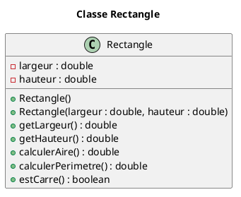
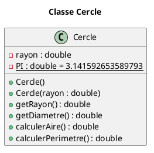
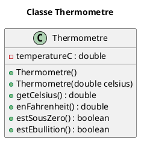

# Exercices – Tests unitaires (JUnit 4) et principe AAA (niveau débutant)

**Rôles** : chaque équipe choisit un rôle principal (ou alterne à mi-parcours) :

- **Concepteur** : implémente la classe Java selon l'UML et les spécifications.
- **Responsable qualité (QA)** : écrit les tests unitaires JUnit 4 (sans implémenter la classe, ou en la recevant du concepteur).

## Objectifs d'apprentissage

- Comprendre et appliquer le **principe AAA** pour des tests lisibles et structurés.
- Écrire des **tests unitaires** simples (constructeurs, getters, calculs, booléens) avec **JUnit 4**.
- Respecter des **spécifications minimales** à partir d'un diagramme UML.

### RAPPEL

> **Principe AAA** :  
    - **A**rrange : préparer les objets et données.  
    - **A**ct : exécuter **une** action ciblée (appel d'une méthode).  
    - **A**ssert : vérifier le **résultat attendu** (égalité, booléen, tolérance pour double, etc.).  

## Consignes générales

1. Travaillez en binôme. Attribuez un rôle principal à chacun (**Concepteur** ou **QA**).
2. Choisissez **une** des 5 classes proposées ci-dessous (toutes ont 2–3 attributs et 5–6 méthodes max).
3. **Concepteur** : implémente la classe **strictement** selon l'UML et les hypothèses.
4. **QA** : rédige **5 à 6 tests** unitaires JUnit 5 **simples**, en suivant l'énumération des tests fournie (noms, données, résultats attendus).
5. **Tolérance pour les doubles** : utilisez une **marge d'erreur** (p. ex. `1e-9`) lorsque pertinent.
6. Organisation possible : chaque équipe teste le code d'une autre équipe (croisé) après une première passe.

**Squelette minimal d'un test JUnit 4 (AAA)** :

```java
import org.junit.Test;
import static org.junit.Assert.*;

class ExempleTest {
    @Test
    void exemple_AAA() {
        // Arrange
        // (préparer les données et l'objet)

        // Act
        // (appeler UNE méthode clé)

        // Assert
        // (vérifier le résultat attendu)
    }
}
```

## Énoncés

- Créer un projet Java ainsi que 5 *packages* `ex1`, `ex2`, ..., `ex5` (un par classe à tester).
- Pour chaque exercice :
  - Le code PlantUML est fourni;
  - **Concepteur** implémente le code de la classe;
  - **QA** implémente la classe de test et rédige les tests listés ci-dessous en suivant le principe AAA;
  - Respecter les hypothèses qui accompagnent chaque classe (ex. valeurs par défaut, tolérances, etc.);
  - Si nécessaire pour la classe de test, ajouter un attribut `static final` appelé `DELTA` pour la tolérance avec une valeur de `1e-9` pour les comparaisons de type `double`.

### 1. Classe `Rectangle`

**PlantUML** Rectangle



**Hypothèses** :

- Constructeur par défaut : `largeur = 1.0`, `hauteur = 1.0`.
- Dimensions fournies supposées **non négatives** (pas d'exceptions à gérer ici).

**Tests à implémenter (AAA)** :

1. `testConstructeurDefaut_valeursParDefaut` ⇒ les getters doivent retourner `1.0` pour les 2 dimensions
2. `testConstructeurSurcharge_valeursAssignees` ⇒ les getters doivent retourner les valeurs fournies (ex. `3.0` et `2.0`)
3. `testCalculerAire_casSimple` → `(3.0, 2.0)` ⇒ l'aire doit correspondre à `6.0`
4. `testCalculerPerimetre_casSimple` → `(3.0, 2.0)` ⇒ le périmètre doit correspondre à `10.0`
5. `testEstCarre_trueQuandLargeurEgaleHauteur` → `(2.5, 2.5)` ⇒ `true`
6. `testEstCarre_falseQuandDimensionsDifferentes` → `(2.5, 3.0)` ⇒ `false`

### 2. Classe `Cercle`

**PlantUML** Cercle



**Hypothèses** :

- Par défaut : `rayon = 1.0`.
- Utiliser `pi` **de la classe**, pas `Math.PI`.

**Tests à implémenter (AAA)** :

1. `testConstructeurDefaut_rayonValeurParDefaut` → `new Cercle()` ⇒ `rayon == 1.0`
2. `testConstructeurSurcharge_assigneRayon` → `new Cercle(2.0)` ⇒ `rayon == 2.0`
3. `testGetDiametre_doubleDuRayon` → `rayon=2.5` ⇒ `diametre == 5.0`
4. `testCalculerAire_casSimple` → `rayon=2.0` ⇒ `aire ≈ 12.566370614359172` (tolérance `1e-9`)
5. `testCalculerPerimetre_casSimple` → `rayon=5.0` ⇒ `perimetre ≈ 78.53981633974483` (tolérance `1e-9`)
6. `testCalculs_rayonZero` → `rayon=0.0` ⇒ `aire == 0.0`, `perimetre == 0.0`

### 3. Classe `Thermometre`

**PlantUML** Thermometre



**Hypothèses** :

- Par défaut : `20.0 °C`.
- Conversion : `F = C * 9/5 + 32`.
- Ébullition : `true` si la température **est égale** à `100.0` °C (avec tolérance).

**Tests à implémenter (AAA)** :

1. `testConstructeurDefaut_20C` → `new Thermometre()` ⇒ `getCelsius()==20.0`
2. `testConstructeurSurcharge_valeurAssignee` → `new Thermometre(-5.0)` ⇒ `-5.0`
3. `testEnFahrenheit_casSimple` → `0.0 °C` ⇒ `32.0 °F` (tolérance `1e-9`)
4. `testEstSousZero_true_tempNegative` → `-0.1 °C` ⇒ `true`
5. `testEstSousZero_false_tempZero` → `0.0 °C` ⇒ `false`
6. `testEstEbullition_true_si100Pile` → `100.0 °C` ⇒ `true`
