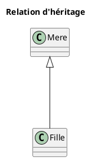

# Programmation orientée objet — Héritage

## 1. Qu'est-ce que l'héritage en Java ?

L'**héritage** est un mécanisme fondamental de la POO qui permet de **créer une nouvelle classe** (appelée *sous-classe* ou *classe dérivée*) **à partir d'une classe existante** (appelée *superclasse*). Cela permet de **réutiliser**, **adapter** et **étendre** le comportement déjà défini.

La classe enfant hérite des attributs et des méthodes du parent (selon leur visibilité), ce qui permet de **réutiliser**, **spécialiser** ou **étendre** son comportement.

On précise qu'une classe enfant *dérive* ou *étend* une classe mère à l'aide du mot-clé `extends` en Java.

```java
public class Mere {
    // des attributs et des méthodes ici
}

public class Fille extends Mere {
    // tous les attributs et méthodes de la classe Mere qui sont public, 
    // protected ou par défaut sont déjà disponibles dans cette classe!
}
```

### Les 4 piliers de la POO

L'héritage est l'un des **4 piliers de la programmation orientée objet**, avec l'encapsulation, le polymorphisme et l'abstraction.

### Relation d'héritage

Il doit exister une relation **EST UN** entre la classe dérivée et son parent.

#### Exemples de relation d'héritage

|Classe de base|Classe dérivée|Relation|
|---|---|---|
|`Animal`|`Chat`|Un `Chat` **est un** `Animal`|
|`Voiture`|`Ferrarri`|Une `Ferrarri` **est une** `Voiture`|
|`Personne`|`Travailleur`|Un `Travailleur` **est une** `Personne`|

### Remarques sur l'héritage

- Une classe **hérite** d'une autre classe via le mot-clé **`extends`**.
- La sous-classe hérite des **méthodes** et **champs visibles** de la superclasse.
- La sous-classe peut **redéfinir** (override) des méthodes pour adapter le comportement.
- Java ne permet que l'**héritage simple** : une classe **étend une seule** superclasse.

### Héritage et UML

Pour illustrer une relation d'héritage dans la syntaxe PlantUML, il s'agit d'ajouter une **flèche pleine avec la tête *vide*** de la **classe dérivée vers la classe de base**. Cette flèche représente la relation **est un**.



### Constructeurs et mot-clé `super(...)`

- Le constructeur de la sous-classe **appelle** un constructeur de la superclasse via **`super(...)`**. Si un appel à `super()` est placé, il doit être la **première instruction** du constructeur de la sous-classe.
- S'il **n'existe pas** de constructeur **sans paramètre** dans le parent, l'appel explicite `super(...)` est **obligatoire** et **doit être la première instruction** du constructeur enfant.

```java
class Personne {
    private String nom;

    // constructeur
    public Personne(String nom) {
         this.nom = nom; 
         }
}
```

```java
class Etudiant extends Personne {
    // constructeur
    public Etudiant(String nom) { 
        super(nom); 
        }
}
```

### `super()` — Initialiser et réutiliser le parent

Le mot-clé `super` réfère à la classe mère. On peut l'utiliser pour :

- Appeler `super(...)` dans le **constructeur enfant** pour **initialiser** l'état du parent (souvent les attributs `private`).
- Appeler `super.methode()` dans une **méthode redéfinie** pour **compléter** le comportement parent.
- Accéder à un attribut du parent qui serait **masqué** : `super.attribut`.

### Exemple d'utilisation de `super`

```java
class Personne {
    private String nom;
    public Personne(String nom) { this.nom = nom; }
    public String getNom() { return nom; }
    public void sePresenter() { System.out.println("Je suis " + nom + "."); }
}
```

```java
class Etudiant extends Personne {
    public Etudiant(String nom) { super(nom); }
    @Override public void sePresenter() {
        super.sePresenter();
        System.out.println("Je suis étudiant.");
    }
}
```

```java
class Main {
    public static void main(String[] args) { 
        Etudiant e = new Etudiant("Alex");
        e.sePresenter(); 
    }
}
```

## 2. Redéfinition (*override*) de méthode

Une classe dérivée peut **redéfinir** une méthode héritée pour **adapter** ou **spécialiser** son comportement.

- La **signature** doit être identique.
- On **ne peut pas réduire** la **visibilité** (une méthode `public` reste `public`). Une méthode `protected` ou `private` pourrait par exemple être redéfinie `public`, mais pas l'inverse.
- Utiliser l'annotation **`@Override`** pour sécuriser la redéfinition auprès du compilateur.

```java
class Animal { 
    public void parler() { 
        System.out.println("L'animal émet un son."); 
    } 
}
```

```java
class Poule extends Animal {
    @Override
    public void parler() {
        System.out.println("La poule caquette."); 
    }
}
```

### Empêcher la redéfinition : le mot-clé `final` pour les méthodes et les classes

Le mot‑clé **`final`** permet de **bloquer** certains aspects de l'héritage afin d'éviter qu'une classe ou une méthode soit modifiée ou étendue.

#### 1. Empêcher la redéfinition d'une méthode

Une méthode déclarée `final` **ne peut pas être redéfinie** dans une sous‑classe.

```java
class Animal {
    public final void dormir() {
        System.out.println("L'animal dort.");
    }
}

class Chat extends Animal {
    // Erreur : impossible de redéfinir une méthode final
    public void dormir() { System.out.println("Le chat dort."); }
}
```

#### 2. Empêcher l'héritage d'une classe

Une classe déclarée `final` **ne peut plus être étendue**.

```java
final class Utilitaire {
    public static void calculer() {}
}
// ❌ Erreur : impossible d'étendre une classe final
class Outil extends Utilitaire {}
```

### Pourquoi utiliser `final` ?

- Garantir un comportement **non modifiable**.
- Empêcher des redéfinitions risquées ou indésirables.
- Sceller une classe lorsque l'héritage n'a **pas de sens conceptuel**.
- Protéger certaines API internes.

## 3. Visibilité des membres hérités

> Un **champ `private`** du parent est **inaccessible** directement par l'enfant, mais un **getter `public`** du parent **reste visible** (accès contrôlé à l'état privé).

- `private` : utilisable **uniquement** dans la classe où il est déclaré.
- `protected` : utilisable dans la classe **et ses sous-classes**.
- *(default)* : utilisable **dans le même paquet**.
- `public` : utilisable **partout**.

**Override et visibilité** :

- On **ne peut pas réduire** la visibilité lors d'un override (`public` → `protected` : **interdit**).
- On peut garder la même visibilité, ou **l'augmenter** (`protected` → `public`).

## 4. Héritage simple ou multiple?

### Définitions

> **Héritage simple** :  
Une classe hérite d'**une seule classe parente**.

#### Avantages : héritage simple

- Simple
- Évite les ambiguïtés
- Plus facile à maintenir

**REMARQUE** : Java ne supporte que l'héritage simple.

> **Héritage multiple** :  
Une classe hérite hérite de **plusieurs classes parentes**.

#### Avantages : héritage multiple

- Permet de combiner plusieurs comportements directement
- Puissant

**REMARQUES** :

- L'héritage multiple peut occasionner des problème d'ambiguïtés : si 2 parents ont la même méthode, laquelle utiliser?
- Java ne supporte pas l'héritage multiple mais une classe peut implémenter plusieurs interfaces, alors celles-ci peuvent être vues comme une solution de remplacement à l'héritage multiple.

## Exemple - Hiérarchie d'animaux

### `Animal`

```java
abstract class Animal {
    private String nom;
    private int age;

    // constructeur
    public Animal(String nom, int age) {
        this.nom = nom; this.age = age; 
    }
    
    public String getNom() { return nom; }
    public int getAge() { return age; }
    public void setAge(int age) { if (age >= 0) this.age = age; }
    public void seDeplacer() { System.out.println(getNom() + " se déplace."); }
    public void parler() { System.out.println(getNom() + " émet un son."); }
}
```

### `Oiseau` + `Poule`

```java
class Oiseau extends Animal {
    public Oiseau(String nom, int age) { super(nom, age); }
    public void voler() {
        System.out.println(getNom() + " vole."); 
    }
    
    @Override public void parler() {
        System.out.println(getNom() + " fait pit pit pit!."); 
    }
}
```

```java
class Poule extends Oiseau {
    public Poule(String nom, int age) { super(nom, age); }
    @Override public void parler() { System.out.println(getNom() + " fait cot cot cot."); }
}
```

### `Mammifere` + `Castor`

```java
class Mammifere extends Animal {
    public Mammifere(String nom, int age) { super(nom, age); }
    public void marcher() { System.out.println(getNom() + " marche."); }
    @Override public void parler() { System.out.println(getNom() + " grogne."); }
}
```

```java
class Castor extends Mammifere {
    public Castor(String nom, int age) { super(nom, age); }
    @Override public void parler() { System.out.println(getNom() + " ronge des arbres."); }
}
```

### Démonstration du cas

```java
public class MainAnimaux {
    public static void main(String[] args) {
        Poule p = new Poule("Claudette", 2);

        p.parler();
        p.seDeplacer();
        p.voler();


        Castor c = new Castor("Loic", 4);
        c.parler();
        c.seDeplacer();
        c.marcher();

        System.out.println("Cette poule se nomme: " + p.getNom());
        System.out.println("Ce castor se nomme: " + c.getNom());
    }
}
```

## Exemple – Hiérarchie appliquée aux sports

```java
public class Sport { 
    private String nom;
    protected int joueursParEquipe;

    // constructeur
    public Sport(String nom, int joueursParEquipe) { 
        this.nom = nom; 
        this.joueursParEquipe = joueursParEquipe;
    }

    public String getNom() { 
        return nom; 
    }

    public int getJoueursParEquipe() { 
        return joueursParEquipe; 
    }
    public void demarrerMatch();  // mais que veux bien dire le mot abstract ici?
    public int marquer();
}
```

```java
class Hockey extends Sport {
    public Hockey() { 
        super("Hockey", 6); 
    }
    @Override public void demarrerMatch() { 
        System.out.println("Mise au jeu au centre! Match de hockey commence."); 
    }
    @Override public int marquer() { 
        System.out.println("But au hockey!"); 
        return 1; 
    }
}
```

```java
class Football extends Sport {
    public Football() { 
        super("Football", 11); 
    }

    @Override public void demarrerMatch() { 
        System.out.println("Coup de pied d'envoi! Match de football commence."); 
    }

    @Override public int marquer() { 
        System.out.println("Touché au football!"); return 6; 
    }
}
```

```java
class Soccer extends Sport {
    public Soccer() { 
        super("Soccer", 11); 
    }
    @Override public void demarrerMatch() {
        System.out.println("Coup d'envoi! Match de soccer commence."); 
    }
    
    @Override public int marquer() {
        System.out.println("But au soccer!"); return 1;
    }
}
```
