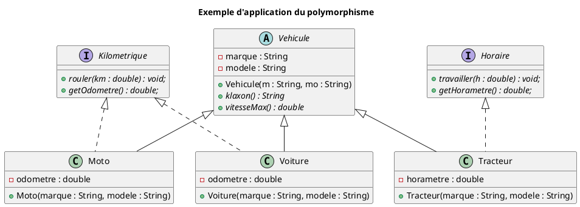

# Le polymorphisme (introduction)

## 1. Qu'est‑ce que le polymorphisme ?

> **Définition** : *Polymorphisme*  
Le **polymorphisme**, c'est la **capacité d'un même code à se comporter différemment** selon le type réel de l'objet manipulé.

En Java, ça se traduit par : **une référence de type parent peut pointer vers un objet de type enfant**, et c'est la méthode de l'enfant qui sera exécutée (si elle est redéfinie). [*Cas dynamique du polymorphisme, très utile en POO.*]

Cela permet d'écrire du **plus flexible**, et **moins répétitif**.

## 2. Les 2 formes de polymorphisme

Le polymorphisme peut se manifester de 2 façons en Java :

1. Le **polymorphisme dynamique** (*runtime*, à l'exécution) — via l'héritage ou les interfaces à l'aide de la redéfinition (*overriding*). Se manifeste à l'exécution du programme par la JVM.
2. Le **polymorphisme statique** (*compile-time*, à la compilation) — via la surcharge de méthodes (*overloading*), où plusieurs méthodes portent le même nom mais des signatures différentes. Se manifeste lors de la compilation, avant que le programme ne soit lancé.

### Polymorphisme dynamique

Une sous‑classe **redéfinit** (*overrides*) le comportement d'**une méthode héritée**.

- même nom de méthode
- mêmes paramètres
- manifestation : **au moment où le programme tourne** (liaison dynamique)

Exemple :

```java
public class Animal {
    public void faireDuBruit() { System.out.println("Je fais du bruit, mais lequel?"); }
}

public class Chien extends Animal {
    @Override
    public void faireDuBruit() { System.out.println("Wouf wouf!"); }
}

// Polymorphisme dynamique (redéfinition, overriding)
Animal a = new Chien(); // référence Animal, objet Chien
a.faireDuBruit();       // appelle la méthode de Chien, pas d'Animal
```

Puisque la méthode `faireDuBruit()` héritée de `Animal` est **redéfinie** (*overridden*), son comportement est différent si elle est exécutée en tant que `Chien` ou en tant qu'`Animal`. Même si `a` est de type `Animal`, Java utilise **la vraie nature de l'objet** (`Chien`) au moment de l'exécution.

### Polymorphisme statique

On crée **plusieurs versions** d'une méthode **avec des paramètres différents**.

- même nom de méthode
- paramètres différents
- manifestation : **décidée par le compilateur** (liaison statique)

Exemple :

```java
public class Calcul {
    public double calculerFormule(int x) { return (double)x + 273.15; }
    public int calculerFormule(double x) { return (int)(x - 273.15); }
}

// Polymorphisme statique (surcharge, overloading)
Calcul c = new Calcul();
double val = c.calculerFormule(30); // méthode calculerFormule(int x) est trouvée
int res = c.calculerFormule(300.0); // méthode calculerFormule(double x) est trouvée

System.out.println(val);    // 303.15
System.out.println(res);    // 26
```

Puisqu'il existe 2 versions **surchargées** (*overloaded*) de la méthode `calculerFormule()` - une pour un paramètre de type `int` et une autre pour un paramètre de type `double` -, alors le **compilateur** décide laquelle sera appelée, avant même que le code ne soit exécuté.

### Résumé rapide

| Aspect | Polymorphisme dynamique | Polymorphisme statique |
| --- | --- | --- |
| **Description** | Remplacer une méthode héritée | Plusieurs formes d'une même méthode |
| **Mécanismes requis** | (Héritage ou Interface) ET Redéfinition (*override*) | Surcharge (*overload*) |
| **Moment** | Décidé à la compilation | Décidé à l'exécution |
| **Paramètres** | Paramètres différents | Paramètres identiques |

## 3. Liaison statique vs dynamique

### Liaison statique

Décision faite **par le compilateur** avant d'exécuter le programme.

- surcharge (*overloading*)
- méthodes `static`
- méthodes `private`

### Liaison dynamique

Décision faite **pendant l'exécution** du programme selon l'objet réel.

- redéfinition (*overriding*))
- appels polymorphes via un type parent

## 4. Exemple d'application du polymorphisme



### Classe abstraite

#### `Vehicule`

```java
public abstract class Vehicule {
    String marque;
    String modele;
    Vehicule(String m, String mo){ marque=m; modele=mo; }

    public abstract String klaxon();
    public abstract double vitesseMax();
}
```

### Interfaces simples

#### `Kilometrique`

```java
public interface Kilometrique {
    void rouler(double km);
    double getOdometre();
}
```

#### `Horaire`

```java
public interface Horaire {
    void travailler(double h);
    double getHorametre();
}
```

### Classes concrètes

#### `Moto`

```java
public class Moto extends Vehicule implements Kilometrique {
    double odometre;
    public Moto(String marque, String modele) {
        super(marque, modele);
        odometre = 0;
    }

    public String klaxon(){ return "pin pin"; }
    public double vitesseMax(){ return 180; }

    public void rouler(double km){ odometre += km; }
    public double getOdometre(){ return odometre; }
}
```

#### `Voiture`

```java
public class Voiture extends Vehicule implements Kilometrique {
    double odometre;
    public Voiture(String marque, String modele) {
        super(marque, modele);
        odometre = 0;
    }

    public String klaxon(){ return "pouet pouet"; }
    public double vitesseMax(){ return 210; }

    public void rouler(double km){ odometre += km; }
    public double getOdometre(){ return odometre; }
}
```

#### `Tracteur`

```java
public class Tracteur extends Vehicule implements Horaire {
    double horametre;
    public Tracteur(String marque, String modele) {
        super(marque, modele);
        horametre = 0;
    }

    public String klaxon(){ return "BRAAAP"; }
    public double vitesseMax(){ return 40; }

    public void travailler(double h){ horametre += h; }
    public double getHorametre(){ return horametre; }
}
```

## 5. Démonstration du polymorphisme

### Classe de test

#### `DemoPolymorphisme`

```java
import java.util.ArrayList;
import java.util.List;
import polymorphisme.*;

public class DemoPolymorphisme {

    public static void main(String[] args) {
        Tracteur t1 = new Tracteur("Kioti", "CK25");
        t1.travailler(50.5);
        Tracteur t2 = new Tracteur("Kioti", "CK40");
        t2.travailler(44.8);

        Moto m1 = new Moto("Honda", "CRZ100");
        m1.rouler(155.5);
        Moto m2 = new Moto("Vespa", "Scooter");
        m2.rouler(233.8);

        Voiture a1 = new Voiture("Toyota", "Yaris");
        a1.rouler(203.1);
        Voiture a2 = new Voiture("Mazda", "B4000");
        a2.rouler(1013.9);

        List<Vehicule> flotte = new ArrayList<>();
        flotte.add(t1);
        flotte.add(t2);

        flotte.add(a1);
        flotte.add(a2);

        flotte.add(m1);
        flotte.add(m2);

        for (Vehicule v : flotte) {
            // Comportement propre à TOUS les véhicules
            System.out.println(v.klaxon()); // chacun sa version
            
            // Seulement les Voiture + Moto, c'est à dire les Kilometrique
            if(v instanceof Voiture || v instanceof Moto) {
                Kilometrique obj; // type commun aux Moto et Voiture!
                if(v instanceof Voiture) {
                    obj = (Voiture)v;   // transtypage!
                }
                else {
                    obj = (Moto)v;      // transtypage!
                }
                System.out.printf("Odomètre = %.1f%n", obj.getOdometre());
            }

            // Les Tracteur (ou Horaire)
            if(v instanceof Tracteur) {
                ((Horaire)v).travailler(10.0);              // transtypage avec interface pour appeler .travailler()!
                double h = ((Tracteur)v).getHorametre();    // transtypage + appel de méthode!
                System.out.printf("Horamètre = %.1f%n", h);
            }
        }
    }

}
```

## 6. Ce qu'il faut retenir du polymorphisme

- Le polymorphisme dynamique permet de **manipuler différents objets** avec un **même type parent**.
- Le polymorphisme statique permet de **manipuler différentes méthodes** d'un **même objet**.
- La liaison dynamique est au coeur de la POO.
- Les interfaces permettent l'application du polymorphisme en l'absence d'héritage.
