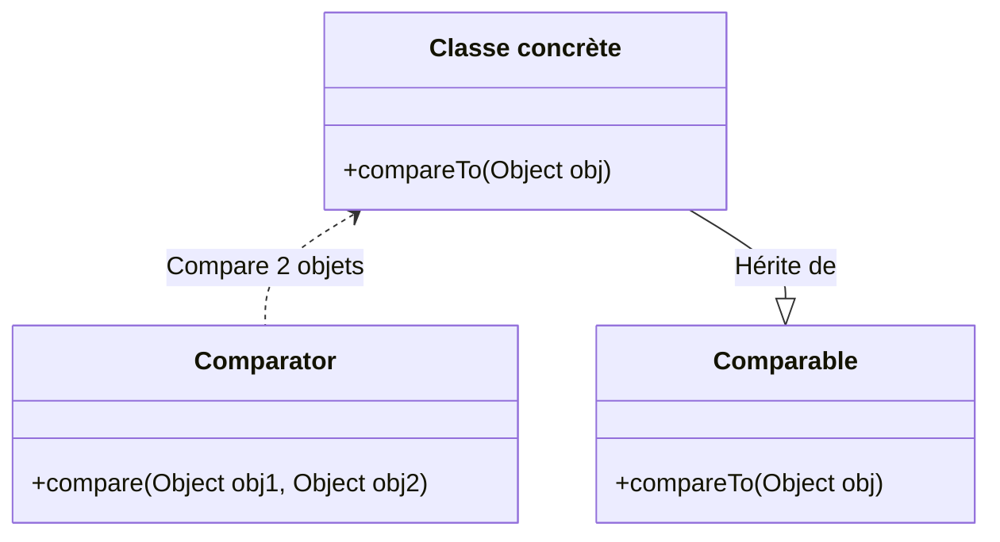

# `Comparator` en java

## 1. Trie d'objets

- Pour trier des objets en java, on peut définir une *classe utilitaire comparatrice* qui pourra trier nos objets selon une règle.
- *Différence avec l'ordre naturuel de Comparable*: L'ordre naturel est l'ordre de trie qui est implémenté dans la classe, tandis que la classe comparatrice pourra réaliser des **ordres de trie alternatifs**.



## 2. Aperçu - Interface `Comparator`

> **Référence** :
[Interface `Comparator`](https://docs.oracle.com/javase/8/docs/api/java/util/Comparator.html)

L'interface `Comparator` de Java propose une seule méthode, `compare(Object obj1, Object obj2)`, qui sert à **implémenter un ordre de trie personnalisé entre 2 objets**. Elle permet ainsi de **trier les objets**.

La méthode respecte le principe suivant : `compare(Object obj1, Object obj2)` retourne un entier

- **`< 0`** si `obj1` est **avant** `obj2`
- **`0`** si **égalité d'ordre**
- **`> 0`** si `obj1` est **après** `obj2`

### Pour implémenter `Comparator`, il faut 3 choses

1. Une classe concrète que l'on désire trier
2. Créer une nouvelle classe comparatrice implémentant l'interface `Comparator`
3. Implémenter la méthode `compare()` qui définit l'ordre de trie entre 2 objets

## 3. Contrat minimal à respecter

La méthode `compare()` doit s'assurer de respecter les propriétés suivantes :

- **Antisymétrie** : `sgn(Comparator.compare(a, b)) == -sgn(Comparator.compare(b, a))`
- **Transitivité** : si `a > b` et `b > c` alors `a > c`

## 4. Exemples

> **Référence** :
[w3schools - Java Advanced Sorting](https://www.w3schools.com/java/java_advanced_sorting.asp)

Avec une classe Voiture qui comporte un attribut *année*.
```java
class TrieVoitureParAnnée implements Comparator {
    public int compare(Object obj1, Object obj2) {
        // Attention: Il faut transtyper les objets en classe Voiture

        // Pourquoi transtyper sans avoir la vérification instanceof ?
        Voiture a = (Voiture) obj1
        Voiture b = (Voiture) obj2

        // Comparaison des objets
        // Trie du "Plus petit au plus grand"
        if (a.année < b.année) return -1; // La première voiture avant la deuxième
        if (a.année > b.année) return 1; // La première voiture après la deuxième
        return 0; // Les deux voitures ont la même année
    }
}

public class Main {
    public static void main(String[] args) {
        ArrayList<Voiture> mesVoitures = new Arraylist<Voiture>();    
        mesVoitures.add(new Car("BMW", "X5", 1999));
        mesVoitures.add(new Car("Honda", "Accord", 2006));
        mesVoitures.add(new Car("Ford", "Mustang", 1970));

        // On créer le comparateur
        Comparator monComparateur = new TrieVoitureParAnnée();
        
        // On trie la liste de voiture
        Collections.sort(mesVoitures, monComparateur);
    }
}
```

### Usage d'une expression Lambda

Pour réduire l'espace de code et fichiers nécessaires, on peut utiliser une `expression lambda` qui a les même arguments et valeur de retour que la fonction `compare()`.

```java
Collections.sort(mesVoitures, (Voiture a, Voiture b) -> {
    if (a.année < b.année) return -1;
    if (a.année > b.année) return 1;
    return 0;
});
```

> **Complément** :
[w3schools - Java Lambda Expressions](https://www.w3schools.com/java/java_lambda.asp)
