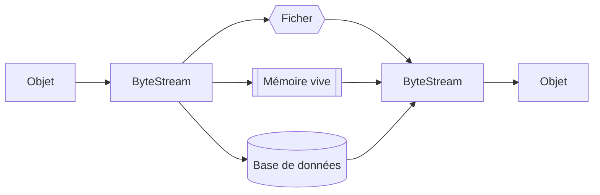

# `Serializable` en java

## Sauvegarde des objets

Il peut être très utile de sauvegarder ses objets instanciés dans une mémoire permanente à la place de la mémoire temporaire du programme java.



Pour ce faire, il faut que nos objets implémentent l'interface `Serializable`

> ```java
> public interface Serializable
> ```

### Sérialisation de l'objet

> **Référence** :
[Interface `Serializable`](https://www.geeksforgeeks.org/java/serializable-interface-in-java/)

#### `Etudiant.java`
```java
import java.io.Serializable;

public class Etudiant implements Serializable {
    private static final long serialVersionUID = 1L; // On va voir plus bas à quoi ça sert
    public String nom;
    public String département;
    public int matricule;

    // ...
}
```

#### `App.java`

```java
import java.io.*;

public class App {
    public static void main(String[] args) throws IOException, ClassNotFoundException {
        Etudiant etudiant = new Etudiant("Étienne Demers", "Informatique", 435622);

        // Sérialisation en vue de l'enregistrement
        FileOutputStream fos = new FileOutputStream("etudiant.txt");

        ObjectOutputStream oos = new ObjectOutputStream(fos);

        oos.writeObject(etudiant);

        // Fermeture du stream
        oos.close();

        // Dé-sérialisation pour charger dans le programme java
        FileInputStream fis = new FileInputStream("etudiant.txt");
        
        ObjectInputStream ois = new ObjectInputStream(fis);

        Etudiant etudiantChargé = (Etudiant) ois.readObject()
        
        // Fermeture du stream
        ois.close();

        System.out.println(etudiantChargé);
    }
}
```

### Attribut `transient`

Un attribut `transient` n'est pas enregistré dans le fichier de mémoire bytecode.

#### `Etudiant.java`
```java
import java.io.Serializable;

public class Etudiant implements Serializable {
    private static final long serialVersionUID = 1L; // On va voir plus bas à quoi ça sert
    public String nom;
    public String département;
    public int matricule;
    public transient int age; // attribut non enregistré

    // ...
}
```

### Modification d'une classe après enregistrement

> **Attention !** Si on modifie la classe après avoir enregistré des objets de celle-ci, par défaut, nous allons avoir une erreur du genre:

><span style="color:red">Exception in thread "main" java.io.InvalidClassException: Etudiant; local class incompatible: stream classdesc serialVersionUID = 8584930345365, local class serialVersionUID = -2700879061632927918</span>

Ce qui veut dire que la version de l'objet enregistré est la version `8584930345365`, et que la version de l'objet dans notre programme java est maintenant `-2700879061632927918`. Cette différence de version de l'attribut `serialVersionUID` cause cette erreur. Si on définit nous-même la valeur de `serialVersionUID`, c'est nous-même qui dictera quand l'objet aura changé de version et qu'il faudra lancer cette erreur.

>```java
>private static final long serialVersionUID = 1L; // À ajouter comme attribut dans la classe sérialisable
>```

On peut maintenant charger des objets avec des attributs manquants ou en plus. Les attributs manquants sont initialisés à leur valeur par défaut, et les attributs en plus sont ignorés.