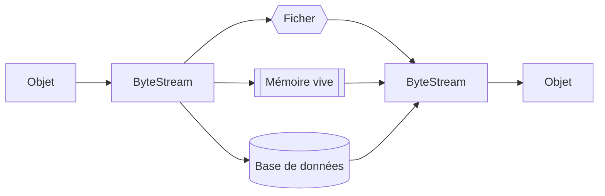

# `Serializable` en java

## Sauvegarde des objets

Il peut être très utile de sauvegarder ses objets instanciés dans une mémoire permanente à la place de la mémoire temporaire du programme java.



Pour ce faire, il faut que nos objets implémentent l'interface `Serializable`

> ```java
> public interface Serializable
> ```

### Sérialisation de l'objet

> **Référence** :
[Interface `Serializable`](https://www.geeksforgeeks.org/java/serializable-interface-in-java/)

#### `Etudiant.java`
```java
import java.io.Serializable;

public class Etudiant implements Serializable {
    public String nom;
    public String département;
    public int matricule;

    // ...
}
```

#### `App.java`

```java
import java.io.*;

public class App {
    public static void main(String[] args) throws IOException, ClassNotFoundException {
        Etudiant etudiant = new Etudiant("Étienne Demers", "Informatique", 435622);

        // Sérialisation en vue de l'enregistrement
        FileOutputStream fos = new FileOutputStream("etudiant.txt");

        ObjectOutputStream oos = new ObjectOutputStream(fos);

        oos.writeObject(etudiant);

        // Fermeture du stream
        oos.close();

        // Dé-sérialisation pour charger dans le programme java
        FileInputStream fis = new FileInputStream("etudiant.txt");
        
        ObjectInputStream ois = new ObjectInputStream(fis);

        Etudiant etudiantChargé = (Etudiant) ois.readObject()
        
        // Fermeture du stream
        ois.close();

        System.out.println(etudiantChargé);
    }
}
```